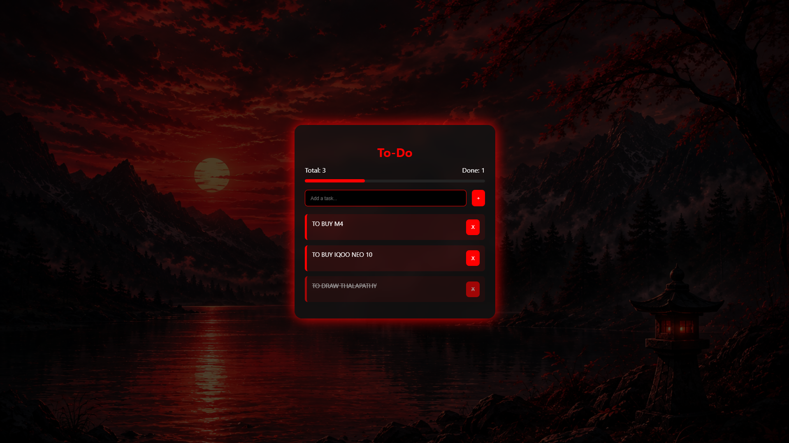

# Ex03 To-Do List using JavaScript
## Date:

## AIM
To create a To-do Application with all features using JavaScript.

## ALGORITHM
### STEP 1
Build the HTML structure (index.html).

### STEP 2
Style the App (style.css).

### STEP 3
Plan the features the To-Do App should have.

### STEP 4
Create a To-do application using Javascript.

### STEP 5
Add functionalities.

### STEP 6
Test the App.

### STEP 7
Open the HTML file in a browser to check layout and functionality.

### STEP 8
Fix styling issues and refine content placement.

### STEP 9
Deploy the website.

### STEP 10
Upload to GitHub Pages for free hosting.

## PROGRAM

### HTML
```
<!DOCTYPE html>
<html lang="en">
<head>
<meta charset="UTF-8">
<title>Ultra To-Do</title>
<link rel="stylesheet" href="style.css">
</head>
<body>

<div class="container">

    <h1>To-Do</h1>

    <div class="top-bar">
        <span>Total: <span id="totalCount">0</span></span>
        <span>Done: <span id="completedCount">0</span></span>
    </div>

    <div class="progress">
        <div id="progressBar"></div>
    </div>

    <div class="input-section">
        <input type="text" id="taskInput" placeholder="Add a task...">
        <button onclick="addTask()">+</button>
    </div>

    <ul id="taskList"></ul>

</div>

<script src="script.js"></script>
</body>
</html>
```
### CSS
```
body {
    margin: 0;
    font-family: 'Segoe UI';

    background: url("background.png") no-repeat center center fixed;
    background-size: cover;

    display: flex;
    justify-content: center;
    align-items: center;
    height: 100vh;
}

/* dark overlay */
body::before {
    content: "";
    position: absolute;
    inset: 0;
    background: rgba(0,0,0,0.7);
}

/* main container */
.container {
    position: relative;
    z-index: 1;
    width: 350px;
    padding: 20px;
    border-radius: 15px;
    backdrop-filter: blur(10px);
    background: rgba(20, 20, 20, 0.7);
    box-shadow: 0 0 25px red;
    color: white;
}

/* heading */
h1 {
    text-align: center;
    color: red;
    margin-bottom: 10px;
}

/* top stats */
.top-bar {
    display: flex;
    justify-content: space-between;
    font-size: 13px;
    margin-bottom: 10px;
}

/* progress bar */
.progress {
    width: 100%;
    height: 6px;
    background: #222;
    border-radius: 5px;
    margin-bottom: 15px;
}

#progressBar {
    height: 100%;
    width: 0%;
    background: red;
    border-radius: 5px;
    transition: 0.3s;
}

/* input */
.input-section {
    display: flex;
    gap: 10px;
}

input {
    flex: 1;
    padding: 10px;
    background: #000;
    border: 1px solid red;
    color: white;
    border-radius: 6px;
}

button {
    padding: 10px;
    background: red;
    border: none;
    border-radius: 6px;
    cursor: pointer;
    color: white;
}

button:hover {
    background: darkred;
}

/* list */
ul {
    list-style: none;
    padding: 0;
    margin-top: 15px;
}

li {
    padding: 10px;
    margin-bottom: 10px;
    background: rgba(255,0,0,0.1);
    border-left: 4px solid red;
    display: flex;
    justify-content: space-between;
    border-radius: 6px;
    animation: fadeIn 0.3s ease;
}

/* completed task */
.completed {
    text-decoration: line-through;
    opacity: 0.6;
}

/* animation */
@keyframes fadeIn {
    from {
        opacity: 0;
        transform: translateY(10px);
    }
    to {
        opacity: 1;
        transform: translateY(0);
    }
}
```
### JAVASCRIPT
```
let input = document.getElementById("taskInput");
let taskList = document.getElementById("taskList");

// load saved tasks
window.onload = loadTasks;

// enter key
input.addEventListener("keypress", function (e) {
    if (e.key === "Enter") addTask();
});

function addTask() {
    let text = input.value.trim();
    if (text === "") return;

    createTask(text, false);
    saveTasks();
    input.value = "";
}

function createTask(text, completed) {
    let li = document.createElement("li");
    li.textContent = text;

    if (completed) li.classList.add("completed");

    li.onclick = function () {
        li.classList.toggle("completed");
        reorderTasks();   // move task
        updateCounts();
        saveTasks();
    };

    let del = document.createElement("button");
    del.textContent = "X";
    del.onclick = function (e) {
        e.stopPropagation();
        li.remove();
        updateCounts();
        saveTasks();
    };

    li.appendChild(del);
    taskList.appendChild(li);

    reorderTasks();  // maintain order
    updateCounts();
}

// move completed tasks to bottom
function reorderTasks() {
    let tasks = Array.from(taskList.children);

    tasks.sort((a, b) => {
        return a.classList.contains("completed") - b.classList.contains("completed");
    });

    taskList.innerHTML = "";
    tasks.forEach(t => taskList.appendChild(t));
}

function updateCounts() {
    let tasks = document.querySelectorAll("li");
    let done = document.querySelectorAll(".completed");

    document.getElementById("totalCount").textContent = tasks.length;
    document.getElementById("completedCount").textContent = done.length;

    let percent = tasks.length ? (done.length / tasks.length) * 100 : 0;
    document.getElementById("progressBar").style.width = percent + "%";
}

function saveTasks() {
    let data = [];
    document.querySelectorAll("li").forEach(li => {
        data.push({
            text: li.firstChild.textContent,
            done: li.classList.contains("completed")
        });
    });
    localStorage.setItem("tasks", JSON.stringify(data));
}

function loadTasks() {
    let data = JSON.parse(localStorage.getItem("tasks")) || [];
    data.forEach(t => createTask(t.text, t.done));
}
```
## OUTPUT


## RESULT
The program for creating To-do list using JavaScript is executed successfully.
